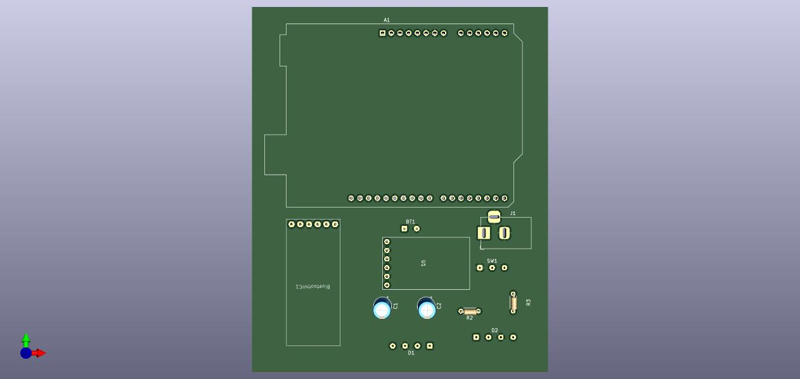

# Shiny Bike

Dispositivo que busca iluminar y señalizar a las bicicletas.

## Descripcion

Este dispositivo busca que los ciclistas puedan señalizar a traves de luces su recorrido en las calles (direccionales, frenado, parqueo). El dispositivo se divide en dos partes, la primera la cual es un control remoto permite al usuario emitir comandos manueales y comandos automaticos para el seña.amiento, segun que comando dicte se enviaran datos via Bluetooth a la segunda parte, la cual se encarga de iluminar los led RGB Ws2812b.

## Objetivos

- Desarrollar un dispositivo que sea capaz de iluminar y señalizar de forma remota a cualquier bicicleta.
- Desarrollar los esquematicos, PCB, diseños y codigos que permitan alcanzar el dispositivo y un buen aprendizaje

## Alcance

Todos los ciclistas que quieran iluminar sus aventuras en la calle.

## Planeación 

### Diagrama de Flujo

Aqui se establecio oficialmente las funciones y las interacciones del dispositivo.

### Diagrama de Cajas Negras

Aqui se establecieron las principales tecnologias.

# Diseño

En esta sección, se empieza diseñar y construir la parte electronica del dispositivo, con lo cual se diseñaron los esquematicos y las PCB.

## Esquematicos

Esquematico Control Remoto

Esquematico Luces

## PCB

PCB del Control Remoto

PCB de apartado de Luces

# Prueba y Trabajo hecho

Aqui se realizaron pruebas en ProtoBoard para corroborar el funcionamiento del codigo y construir el dispositivo final.

## Videos

Links de los videos:
 - Dispositivo funcionamiento [Vdf](https://youtu.be/l_CRdRnh4ok)
 - Explicacion Bluetooth [Veb](https://youtu.be/JUIpYABRpQY)
 - Videos de los problemas [Vp1](https://youtu.be/4-EyFK3v-QM),[Vp2](https://youtube.com/shorts/PcfQB73DB2A?feature=share),[Vp3](https://youtu.be/3R93eb1QBnk)

## Muchas gracias en su visita